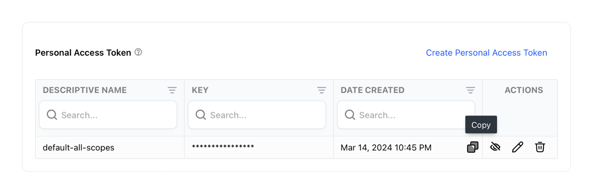

# AI Text Extraction Operation

Extract text from image files within Directus Files with this custom operation, using [Clarifai](https://www.clarifai.com).


This operation requires two options to be set - first a personal access token from [Clarifai](https://www.clarifai.com) (you can find this in your personal settings under [Security](https://clarifai.com/settings/security)), and a link to the image file. It will return a JSON object, with all the found text in a merged string and the raw result from Clarifai with locations of where each found text was found.



You can use the operation to then save the result to a file description or item, or run further automation on the output.


## Output

This operation outputs a JSON object with the following structure:

```json
{
  "merged": "Some words\nthat are\npicked up when\nuploaded.",
  "$raw": {
    "regions": [
      {
        "id": "9334dfc6a721577ee4820f766766b982",
        "region_info": {
          "bounding_box": {
            "top_row": 0.059633028,
            "left_col": 0.22135417,
            "bottom_row": 0.08944954,
            "right_col": 0.5026042
          }
        },
        "data": {
          "text": {
            "raw": "Some words",
            "text_info": {
              "encoding": "UnknownTextEnc"
            }
          }
        },
        "value": 0.95472854
      },
      ...
    ]
  }
}
```

## Flow Setup

### Automatically Transcribe New Files

Create a Flow with an **Event Hook** action trigger and a scope of `files.upload`. Use the AI Text Extraction operation, setting the File URL to `https://your-directus-project-url/assets/{{ $trigger.key }}`, being sure to provide your specific Directus Project URL.

This will work if your file is public, but if it isn't, you can append `?access_token=token` to the File URL, replacing the value with a valid user token that has access to the file.

This operation will trigger on every new file upload, regardless of location or filetype. You may wish to add a conditional step between the trigger and transcription operation. The following condition rule will check that the file is an image:

```json
{
    "$trigger": {
        "payload": {
            "type": {
                "_contains": "image"
            }
        }
    }
}
```

### Transcribe On-Demand

Create a Flow with a **Manual** trigger and select a collection with a file field, which should contain an image file. Set the Location to Item Page Only. To receive the file ID create a **Read Data** operation for the same collection, setting IDs to `{{ $trigger.body.keys[0] }}`.

Use the AI Text Extraction operation, setting the File URL to `https://your-directus-project-url/assets/{{ $last.file_field_name }}`, being sure to provide your specific Directus Project URL and file field name.