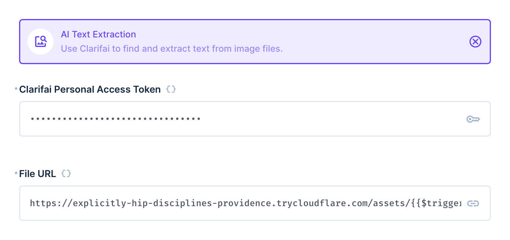
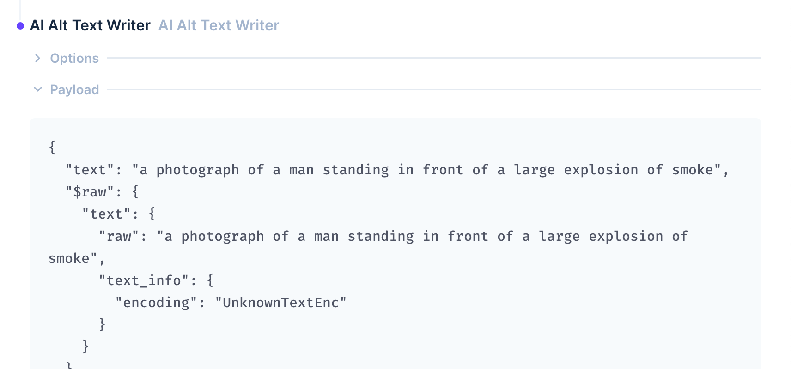

# AI Alt Text Writer Operation

Create captions for your images within Directus Files with this custom operation, using [Clarifai](https://www.clarifai.com).



This operation requires two options to be set - first a personal access token from [Clarifai](https://www.clarifai.com) (you can find this in your personal settings under [Security](https://clarifai.com/settings/security)), and a link to the image file. The operation will return a string containing a text that describes the image.



You can use the operation to then save the result to a file description or item, or run further automation on the output.

## Output

This operation will output the text that was generated from the provided image:

```json
"a photograph of a man standing in front of a large explosion of smoke"
```

## Flow Setup

### Automatically Write Alt Text For New Files

Create a Flow with an **Event Hook** action trigger and a scope of `files.upload`. Use the AI Alt Text Writer operation, setting the File URL to `https://your-directus-project-url/assets/{{ $trigger.key }}`, being sure to provide your specific Directus Project URL.

This will work if your file is public, but if it isn't, you can append `?access_token=token` to the File URL, replacing the value with a valid user token that has access to the file.

This operation will trigger on every new file upload, regardless of location or filetype. You may wish to add a conditional step between the trigger and transcription operation. The following condition rule will check that the file is an image:

```json
{
    "$trigger": {
        "payload": {
            "type": {
                "_contains": "image"
            }
        }
    }
}
```

### Write Alt Text On-Demand

Create a Flow with a **Manual** trigger and select a collection with a file field, which should contain an image file. Set the Location to Item Page Only. To receive the file ID create a **Read Data** operation for the same collection, setting IDs to `{{ $trigger.body.keys[0] }}`.

Use the AI Alt Text Writer operation, setting the File URL to `https://your-directus-project-url/assets/{{ $last.file_field_name }}`, being sure to provide your specific Directus Project URL and file field name.