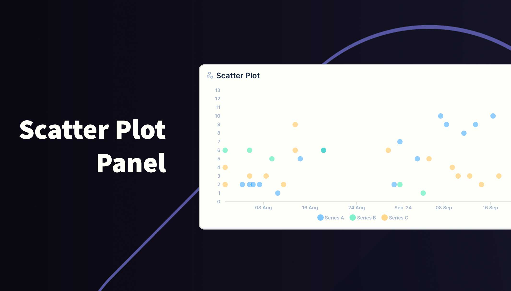
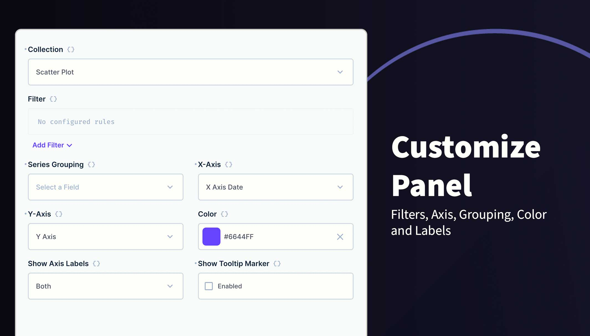

# Directus Scatter Plot Panel

Present a series of X and Y cooradinates as dots on a graph. You can also group data into categories which are presented in different colors.

## Usage

The graph will be rendered within the new panel. While small, the graph won't show legends or labels. Hover over data points to reveal the value (if enabled).

If you choose to group the data into different series, a legend will appear at the bottom. Hover over a series in the legend to highlight all data for that series. You can also toggle which series are visible by clicking the series label in the legend.

You can change the following options:

- Collection Selection
- Filters
- X Axis
- Y Axis
- Group
- Color
- Axis Labels
- Tooltips

## Requirements

- Directus 10.10.0+
- Integer, BigInteger, Float, Decimal, DateTime, Date or Timestamp field for X Axis
- Integer, BigInteger, Float or Decimal field for Y Axis
- X and Y values must be in the same table

## Installation

Refer to the Official Guide for details on installing the extension from the Marketplace or manually.

## How to add this Panel

1. Create a new Panel and select **Scatter Plot** from the list
2. Choose the collection and the fields to use for the X and Y Axis
3. (Optional) Filter the data to your scope
4. (Optional) Select the field to Group data into series
5. (Optional) Use the header to create a name for this panel
6. Save the panel and position/resize as required
7. Save the dashboard

## Permissions

This extension uses the current session permissions and will only show the permitted data.
